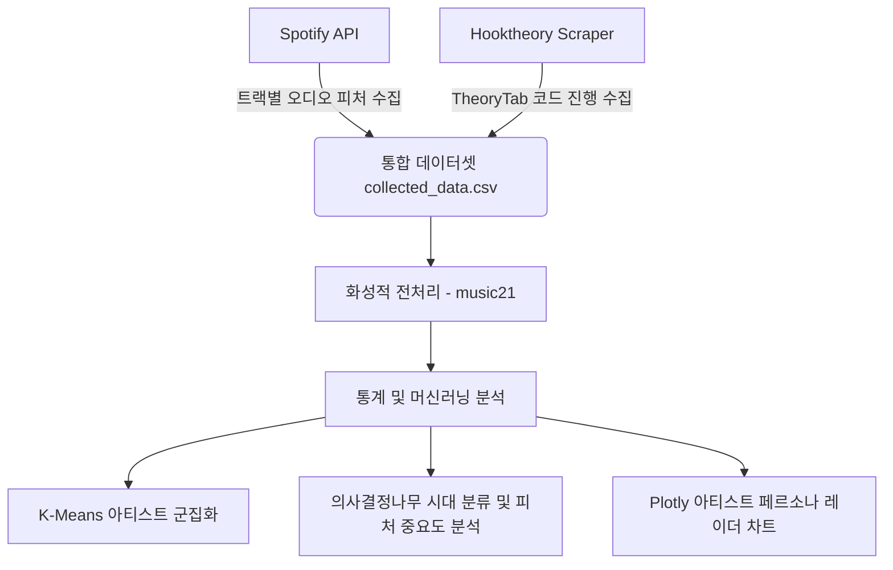

# Chord Analysis with Famous Artists (유명 아티스트들의 음악 특징 및 코드 진행 분석)

본 프로젝트는 **Spotify API**의 음향적 특징(Audio Features) 데이터와 **Hooktheory(TheoryTab)**의 화성적 특징(코드 진행, Chord Progression) 데이터를 융합하여, 1990년대부터 2020년대까지의 대중음악 변천사를 통계적 및 머신러닝 기법으로 규명하는 대학 학기말 프로젝트(Term Project)입니다.

---

## 📊 프로젝트 개요 및 분석 프레임워크

대중음악은 시대의 변화에 따라 화성적 복잡성과 음향적 선호도가 달라집니다. 본 프로젝트는 이를 정량적으로 검증하기 위해 다음과 같은 이종 데이터 결합 및 분석 모델을 사용합니다.



### 1. 주요 수집 대상 (데이터 스케일)
- **대상 범위**: 1990년대, 2000년대, 2010년대, 2020년대 (총 4개 시대)
- **아티스트 스케일**: 시대별 25명, **총 100명의 대표 아티스트** 구성
- **곡수 스케일**: 아티스트별 상위 20곡씩, **총 2,000곡**의 데이터셋을 타겟으로 설계

### 2. 머신러닝 & 통계 모델
* **K-Means Clustering (K=3)**: 음향 지표(댄스빌리티, 에너지 등)와 화성 지표(고유 코드 개수, 비다이아토닉 차용화음 비율)를 기반으로 아티스트 군집화 및 유사 음악 그룹 분석을 수행합니다.
* **Decision Tree Classifier (의사결정나무)**: 각 곡의 음향/화성 특징을 독립 변수로 하여 해당 곡이 발매된 시대를 판별하는 분류기를 학습시키고, 시대 변화를 주도한 핵심 음악 피처의 중요도를 추출합니다.
* **Plotly Radar Chart**: 대표 아티스트들의 음악적 페르소나(음향 vs 화성 특징의 상대적 우위)를 한눈에 비교할 수 있는 대화형 레이더 차트를 제공합니다.

---

## 📂 파일 구조 및 컴포넌트

* **데이터 수집 파이프라인**:
  * [spotify_collector.py](file:///Users/eg/Making%20Art/Chord%20Progression%20Analsys/spotify_collector.py): Spotify API를 활용해 트랙리스트와 댄스빌리티, 에너지, 템포, 밸런스 등 오디오 피처를 추출합니다.
  * [hooktheory_scraper.py](file:///Users/eg/Making%20Art/Chord%20Progression%20Analsys/hooktheory_scraper.py): Hooktheory의 TheoryTab을 크롤링하여 절대 코드 진행을 텍스트 기반으로 정밀하게 획득합니다.
  * [data_collector.py](file:///Users/eg/Making%20Art/Chord%20Progression%20Analsys/data_collector.py): Spotify 데이터와 Hooktheory 데이터를 매핑하여 최종 [collected_data.csv](file:///Users/eg/Making%20Art/Chord%20Progression%20Analsys/collected_data.csv) 파일로 병합 및 저장하는 메인 조율 스크립트입니다.
* **데이터 분석 파이프라인**:
  * [chord_progression_analysis.ipynb](file:///Users/eg/Making%20Art/Chord%20Progression%20Analsys/chord_progression_analysis.ipynb): 수집된 데이터셋을 파싱, 전처리(`music21`), 통계 모델링, 반응형 시각화(Plotly/Seaborn)하여 최종 학술 분석 리포트를 렌더링하는 주피터 노트북입니다.

---

## 🛠️ 개발 환경 구축 및 실행 방법

### 1. 가상환경 및 종속성 라이브러리 설치
본 프로젝트는 전용 가상환경인 `term_project_env`를 구축하여 독립된 종속성을 유지합니다.

```bash
# 가상환경 활성화 (macOS/Linux)
source term_project_env/bin/activate

# 의존성 라이브러리 설치
pip install -r requirements.txt
```

### 2. API 자격 증명 설정 (`.env`)
Spotify API와 통신하기 위해 루트 디렉토리에 `.env` 파일을 생성하고 발급받은 API 키를 입력해야 합니다. (템플릿은 [.env.example](file:///Users/eg/Making%20Art/Chord%20Progression%20Analsys/.env.example) 파일 참고)

```env
SPOTIFY_CLIENT_ID=your_spotify_client_id_here
SPOTIFY_CLIENT_SECRET=your_spotify_client_secret_here
```

### 3. 데이터 수집 실행
설정이 완료되면 메인 수집 엔진을 실행하여 대규모 융합 데이터를 획득합니다.

```bash
# 파일럿 수집 테스트 (Coldplay + Adele 2개 아티스트)
python data_collector.py --pilot

# 전체 100개 아티스트 데이터 수집 실행 (총 2,000곡 규모)
python data_collector.py --all

# 특정 아티스트만 타겟으로 수집할 경우
python data_collector.py --artist "Radiohead"
```

### 4. 노트북 실행 및 분석 리포트 확인
데이터 수집 완료 후, [chord_progression_analysis.ipynb](file:///Users/eg/Making%20Art/Chord%20Progression%20Analsys/chord_progression_analysis.ipynb)를 열어 전체 셀을 실행합니다. `music21` 라이브러리로 수집된 절대 코드 데이터를 가공하여 화성 분석 지표를 추출하고 K-Means 군집 분석 및 의사결정나무 모델 결과를 확인할 수 있습니다.