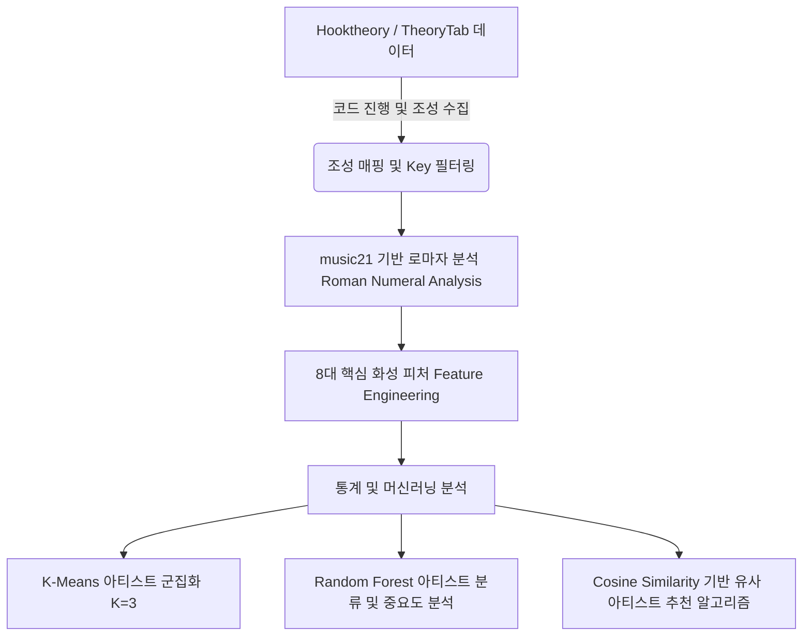

# Chord Analysis with Famous Artists (유명 아티스트들의 코드 진행 및 화성 스타일 분석)

본 프로젝트는 **Hooktheory (TheoryTab)**에서 수집한 유명 아티스트들의 실제 코드 진행(Chord Progression) 데이터를 바탕으로, 1990년대부터 2020년대까지의 대중음악 변천사를 정량적 화성학 데이터 모델링 및 머신러닝 기법으로 규명하는 프로젝트입니다.

---

## 📊 프로젝트 개요 및 분석 프레임워크

대중음악은 시대의 변화에 따라 화성적 복잡성과 선호도가 달라집니다. 본 프로젝트는 이를 정량적으로 검증하기 위해 로마자 분석(Roman Numeral Analysis) 기법과 머신러닝 및 코사인 유사도 알고리즘을 결합한 분석 프레임워크를 사용합니다.



### 1. 분석 대상 및 전처리
- **분석 대상**: 1990년대부터 2020년대까지 총 4개 시대의 대표 아티스트들과 그들의 대표곡
- **코드 개수 필터링**: 화성적 흐름 분석의 유효성을 위해 코드 진행이 4개 미만인 곡은 분석에서 제외 (코드 진행 루프의 최소 단위를 4마디/4코드로 정의하기 위함)
- **조성 매핑 (Key Mapping)**: Dorian, Phrygian, Aeolian 등의 선법(Mode)은 대중음악의 맥락상 마이너(Minor) 성격이 강하므로 Minor(`m`) 조성으로 매핑 및 통일하여 일관성을 확보

---

## 🎼 8대 핵심 화성 피처 (Feature Engineering)

파이썬의 `music21` 라이브러리를 활용해 절대적인 코드명을 상대적인 로마자 기능 분석(Roman Numeral) 기법으로 변환하고, 각 곡의 로마자 코드 시퀀스로부터 음악적 성향을 대변하는 8개의 통계 피처를 추출합니다.

| 피처명 | 설명 | 계산 수식 및 논리 |
| :--- | :--- | :--- |
| **Brightness (밝기)** | 곡의 밝은 느낌을 대변하는 척도 | $\frac{\text{장조 다이아토닉 코드 개수}}{\text{전체 분석 코드 개수}}$ |
| **Minor Ratio (단조 비율)** | 단조 코드가 주는 어둡고 감성적인 분위기 | $\frac{\text{소문자 로마자 코드 개수}}{\text{전체 분석 코드 개수}}$ |
| **Tension Ratio (텐션 비율)** | 세련되고 모던한 재즈적 뉘앙스 | $\frac{\text{7, 9, 11, 13, add, 6 등이 포함된 코드 개수}}{\text{전체 분석 코드 개수}}$ |
| **Non-Diatonic Ratio (비다이아토닉 비율)** | 다이아토닉 스케일을 벗어난 복잡한 진행 정도 | $\frac{\text{조성 외 코드 (Secondary Dominant, Borrowed Chord 등)}}{\text{전체 분석 코드 개수}}$ |
| **Step Motion (순차 진행 비율)** | 선율적이고 부드러운 코드 근음 이동 | $\frac{\text{근음 차이가 1도 또는 6도인 코드 전이 수}}{\text{전체 코드 전이 수}}$ |
| **Leap Motion (도약 진행 비율)** | 극적이고 역동적인 코드 근음 이동 | $\frac{\text{근음 차이가 2도 ~ 5도 사이인 코드 전이 수}}{\text{전체 코드 전이 수}}$ |
| **Loop Ratio (루프 지수)** | 곡의 반복성 및 직관성 | $1.0 - \frac{\text{서로 다른 코드 빅그램(Bigram) 개수}}{\text{전체 코드 전이 수}}$ |
| **Unique Chords (고유 코드 비율)** | 화성적 다양성 | $\frac{\text{고유 코드 종류 수}}{\text{전체 코드 개수}}$ |

---

## 🧠 머신러닝 & 통계 모델

* **K-Means Clustering (K=3)**: 8차원 화성 피처를 기반으로 아티스트들을 군집화하여 유사한 음악적 스타일을 공유하는 아티스트 그룹을 탐색합니다.
* **Random Forest Classifier**: 8대 화성 피처만을 변수로 사용하여 특정 곡이 어떤 아티스트의 곡인지를 예측하는 다중 분류(Multi-class Classification) 모델을 학습시킵니다. 이를 통해 아티스트 간 화성적 고유성과 보편성을 검증하고, 시대별/장르별 핵심 화성 피처의 중요도를 추출합니다.
* **Cosine Similarity (코사인 유사도)**: 아티스트별로 요약된 8차원 피처 벡터 간의 각도를 계산하여 90% 이상의 매우 높은 화성적 닮은꼴을 가진 아티스트들을 정밀 매칭하는 추천 알고리즘입니다.

---

## 📈 핵심 분석 결과 및 해석

1. **시대별 화성 트렌드 변화 (1990년대 ~ 2020년대)**
   - **비다이아토닉 비율의 감소**: 90년대에 비해 2020년대로 올수록 조성 외 코드의 사용 빈도가 줄어들어, 대중음악의 전개가 직관적이고 편안한 화성 구조로 수렴하는 양상을 보입니다.
   - **텐션 코드 비율의 폭발적 증가**: R&B, 시티팝, 힙합 등의 트렌드에 발맞춰 7화음 및 텐션 음의 활용이 급격히 증가했습니다.
   - **루프 지수의 상승**: 4마디 단위 루프가 곡 전체를 장악하는 미니멀리즘 트렌드가 뚜렷하게 입증되었습니다.
   - **요약**: 현대 대중음악은 *"코드 전개 구조는 단순하고 반복적으로 만들되, 개별 코드의 텐션감을 높여 세련되게 디자인하는 미니멀리즘"*으로 진화하고 있습니다.

2. **아티스트 분류 모델의 한계와 시사점 (Random Forest)**
   - Random Forest 모델의 아티스트 분류 정확도는 **4.4%**로 낮게 도출되었습니다.
   - 이는 단순 성능 미달이 아닌, **대중음악 필드에서 수많은 아티스트들이 화성적 클리셰(머니코드 등)를 매우 높은 밀도로 공유하고 있음**을 역설적으로 나타냅니다.
   - 따라서 "이 곡은 A 가수의 노래다"라고 이분법적으로 차단하는 분류 모델보다, **"A 곡은 B 곡과 화성적으로 95% 닮아있다"고 추천하는 코사인 유사도 알고리즘이 훨씬 유용함**을 정량적으로 입증했습니다.

---

## 📂 파일 구조 및 컴포넌트

* **데이터 수집 및 정의**:
  * [massive_song_list.py](file:///Users/eg/Making%20Art/Chord%20Progression%20Analsys/massive_song_list.py): 시대별 타겟 아티스트 리스트 및 곡 메타데이터 정의
  * [hooktheory_scraper.py](file:///Users/eg/Making%20Art/Chord%20Progression%20Analsys/hooktheory_scraper.py): Hooktheory의 TheoryTab을 크롤링하여 절대 코드 진행을 텍스트 기반으로 정밀 획득하는 수집기
  * [data_collector.py](file:///Users/eg/Making%20Art/Chord%20Progression%20Analsys/data_collector.py): 수집된 코드 정보와 메타데이터를 매핑하여 최종 [collected_data.csv](file:///Users/eg/Making%20Art/Chord%20Progression%20Analsys/collected_data.csv) 파일로 병합 및 저장하는 메인 조율 스크립트

* **데이터 분석 및 시각화**:
  * [chord_progression_analysis.ipynb](file:///Users/eg/Making%20Art/Chord%20Progression%20Analsys/chord_progression_analysis.ipynb): 데이터셋을 파싱, 전처리(`music21`), 피처 계산, 군집화 및 머신러닝 분석 결과를 인터랙티브하게 렌더링하는 주피터 노트북
  * [chord_progression_analysis.py](file:///Users/eg/Making%20Art/Chord%20Progression%20Analsys/chord_progression_analysis.py): 노트북의 로직을 일괄 실행하고 분석 결과를 즉시 출력 및 시각화할 수 있도록 구현된 파이썬 스크립트

* **발표 자료 가이드**:
  * [presentation_guide.md](file:///Users/eg/Making%20Art/Chord%20Progression%20Analsys/presentation_guide.md): 프로젝트의 핵심 이론적 배경, 수학적 로직, 수치 해석 및 슬라이드별 발표 대본(Script) 정리 문서

---

## 🛠️ 개발 환경 구축 및 실행 방법

### 1. 가상환경 및 종속성 라이브러리 설치
본 프로젝트는 전용 가상환경인 `term_project_env`를 구축하여 독립된 종속성을 유지합니다.

```bash
# 가상환경 활성화 (macOS/Linux)
source term_project_env/bin/activate

# 의존성 라이브러리 설치
pip install -r requirements.txt
```

### 2. 데이터 분석 및 결과 확인
데이터셋이 이미 존재하므로, 아래 명령어를 실행하여 8대 핵심 피처 추출부터 군집화, 분류 정확도 산출, 코사인 유사도 상위 아티스트 추천 매칭까지의 모든 분석 파이프라인을 일괄 실행하고 결과를 시각적으로 확인합니다.

```bash
python chord_progression_analysis.py
```