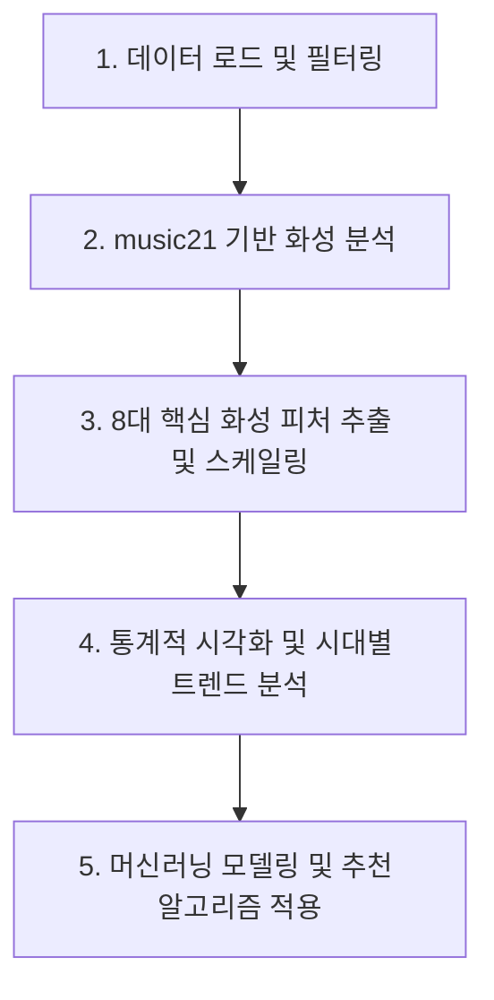

# 대중음악 화성 스타일 분석 및 유사도 기반 추천 시스템 발표 가이드
본 문서는 화성 진행(Chord Progression) 데이터를 활용한 대중음악 스타일 분석 프로젝트의 전체 흐름, 기술적·수학적 로직, 실험 수치 해석, 그리고 발표용 대본까지 한 번에 정리한 가이드라인입니다.

---

## 1. 프로젝트 개요 & 연구 배경

### 1.1. 연구 배경 및 목적
* **배경:** 대중음악의 핵심적인 매력은 멜로디와 가사뿐만 아니라 이를 뒷받침하는 **화성 진행(Chord Progression)**에서 나옵니다. 특정 장르나 시대, 혹은 아티스트마다 선호하는 독특한 화성적 지문(Harmonic Fingerprint)이 존재합니다.
* **목적:** 
  1. 수집된 곡들의 코드 진행을 화성학적 데이터로 변환하고 정량적 피처(Feature)를 추출합니다.
  2. 1990년대부터 2020년대까지의 **시대별 화성 트렌드 변화**를 추적합니다.
  3. 머신러닝 분류 모델의 한계를 통해 대중음악 화성 공유의 보편성을 확인합니다.
  4. **코사인 유사도(Cosine Similarity)** 및 **K-Means 군집화**를 결합하여 실용적인 유사 아티스트 추천 시스템을 제안합니다.

---

## 2. 전체 분석 파이프라인 (Pipeline)

프로젝트는 다음의 5가지 단계로 수행됩니다.

---

## 3. 단계별 기술적 · 수학적 로직

### 3.1. 전처리 및 Key Mapping
* **코드 개수 필터링:** 화성적 흐름을 분석하기 위해 코드 개수가 4개 미만인 곡은 분석 대상에서 제외합니다. (코드 진행 루프의 최소 단위를 4마디/4코드로 정의하기 위함)
* **조성 매핑 (Key Mapping):** Dorian, Phrygian, Aeolian 등의 선법(Mode)은 대중음악에서 사실상 단조의 색채를 띠므로 Minor(`m`) 조성으로 병합하여 분석의 일관성을 높입니다.

### 3.2. music21 기반 로마자 분석 (Roman Numeral Analysis)
단순한 코드 이름(예: C, Am, Dm, G)은 곡의 Key(조성)에 따라 기능이 달라집니다. 따라서 파이썬의 `music21` 라이브러리를 활용해 절대적인 코드명을 해당 조성 내에서의 **상대적인 로마자 기능 분석(Roman Numeral)**으로 변환합니다.
* 예: C Major Key에서 `C -> Am -> Dm -> G`는 `I -> vi -> ii -> V`로 변환됩니다.

### 3.3. 8대 핵심 화성 피처 (Feature Engineering)
각 곡의 로마자 코드 시퀀스로부터 음악적 성향을 대변하는 8개의 통계 피처를 추출합니다.

| 피처명 | 설명 | 계산 수식 및 논리 |
| :--- | :--- | :--- |
| **Brightness (밝기)** | 곡의 밝은 느낌을 대변하는 척도 | $\frac{\text{장조 다이아토닉 코드 개수}}{\text{전체 분석 코드 개수}}$ |
| **Minor Ratio (단조 비율)** | 단조 코드가 주는 어둡고 감성적인 분위기 | $\frac{\text{소문자 로마자 코드 개수}}{\text{전체 분석 코드 개수}}$ |
| **Tension Ratio (텐션 비율)** | 세련되고 모던한 재즈적 뉘앙스 | $\frac{\text{7, 9, 11, 13, add, 6 등이 포함된 코드 개수}}{\text{전체 분석 코드 개수}}$ |
| **Non-Diatonic Ratio (비다이아토닉 비율)** | 다이아토닉 스케일을 벗어난 복잡한 진행 정도 | $\frac{\text{조성 외 코드 (Secondary Dominant, Borrowed Chord 등)}}{\text{전체 분석 코드 개수}}$ |
| **Step Motion (순차 진행 비율)** | 선율적이고 부드러운 코드 근음 이동 | $\frac{\text{근음 차이가 1도 또는 6도인 코드 전이 수}}{\text{전체 코드 전이 수 (Total Transitions)}}$ |
| **Leap Motion (도약 진행 비율)** | 극적이고 역동적인 코드 근음 이동 | $\frac{\text{근음 차이가 2도 ~ 5도 사이인 코드 전이 수}}{\text{전체 코드 전이 수 (Total Transitions)}}$ |
| **Loop Ratio (루프 지수)** | 곡의 반복성 및 직관성 | $1.0 - \frac{\text{서로 다른 코드 빅그램(Bigram) 개수}}{\text{전체 코드 전이 수}}$ |
| **Unique Chords (고유 코드 비율)** | 화성적 다양성 | $\frac{\text{고유 코드 종류 수}}{\text{전체 코드 개수}}$ |

### 3.4. 데이터 정규화 (Normalization)
서로 다른 스케일을 가진 8가지 피처를 동일한 가중치로 비교하기 위해 **MinMaxScaler**를 적용하여 모든 피처값을 $[0, 1]$ 범위로 변환합니다.
$$X_{scaled} = \frac{X - X_{min}}{X_{max} - X_{min}}$$

### 3.5. K-Means 군집화 (Clustering)
아티스트들의 평균 화성 피처를 기반으로 유사한 음악적 스타일을 가진 아티스트들을 3개의 군집(Cluster)으로 묶습니다.
* **목적 함수:** 군집 내 분산(Within-Cluster Sum of Squares, WCSS) 최소화
$$\arg\min_{S} \sum_{i=1}^{k} \sum_{x \in S_i} \|x - \mu_i\|^2$$

### 3.6. Random Forest 분류 모델 (Classification)
* **목적:** 8가지 화성 피처를 활용해 특정 곡이 어떤 아티스트의 곡인지 분류합니다.
* **알고리즘:** 100개의 의사결정나무(Decision Tree)를 앙상블한 bagging 모델을 생성하여 다수결(Majority Voting)로 최종 아티스트 클래스를 예측합니다.

### 3.7. 코사인 유사도 (Cosine Similarity)
아티스트별로 요약된 8차원 피처 벡터 간의 각도를 측정하여 스타일의 닮은꼴을 정밀 분석합니다.
$$Similarity(A, B) = \cos(\theta) = \frac{A \cdot B}{\|A\| \|B\|} = \frac{\sum_{i=1}^n A_i B_i}{\sqrt{\sum_{i=1}^n A_i^2} \sqrt{\sum_{i=1}^n B_i^2}}$$

---

## 4. 핵심 분석 결과 및 해석

### 4.1. 시대별 화성 트렌드 변화 (1990년대 ~ 2020년대)
* **비다이아토닉 비율 감소 추이:** 90년대에 비해 현대 음악으로 올수록 조성 외 코드의 사용률이 완만하게 감소합니다. 이는 대중음악이 복잡한 전개보다 보다 직관적이고 듣기 편한 화성 구조로 수렴하고 있음을 시사합니다.
* **텐션 코드 비율의 급격한 증가:** 현대 대중음악(R&B, 힙합, 시티팝 등)으로 올수록 7화음 및 텐션 음의 활용이 폭발적으로 늘어났습니다. 곡의 기본적인 전개는 단순하게 가져가되, 코드 자체의 색채(Color)는 세련되게 다듬는 경향성을 보여줍니다.
* **루프(반복) 지수의 증가 추이:** 힙합의 루프 사운드와 미니멀리즘 음악 트렌드가 반영되어, 현대 음악은 긴 서사적인 코드 진행보다 4마디 내외의 코드 진행을 곡 전체 동안 계속 반복(Looping)하는 경향이 매우 강해졌습니다.

### 4.2. Random Forest 아티스트 분류 정확도: 4.4%
* **수치적 해석:** 아티스트당 학습 데이터가 부족한 점(곡 수 $\ge 4$)과 대형 다중 분류(Multi-class)라는 태생적 난이도가 결합한 결과입니다. (무작위로 찍을 확률인 $1 \sim 2\%$보다는 높으나 매우 낮은 수치)
* **학술적/음악적 해석:** 대중음악에서 **아티스트들이 특정 화성적 구조(머니코드 등)를 매우 높은 밀도로 공유**하고 있기 때문에 발생한 현상입니다. 즉, "화성 정보만으로는 아티스트를 단일 범주로 완전히 격리하여 분류하는 것이 원리적으로 불가능하다"는 음악적 특성을 역설적으로 증명합니다.

### 4.3. 코사인 유사도 상위 아티스트 쌍
* 아티스트들의 8차원 화성 분석 벡터를 비교한 결과, 특정 아티스트 쌍들이 **90%가 넘는 높은 화성적 스타일 유사도**를 보였습니다. 이는 서로 다른 가수라도 화성적 색채(마이너 비율, 반복도, 텐션감 등)를 공유하고 있음을 명확하게 정량적 수치로 보여주는 대목입니다.

---

## 5. 음악 산업적 인사이트 (Insights)

1. **미니멀리즘과 세련미의 조화:** 현대 대중음악은 복잡한 코드 진행의 변화를 지양(Loop Ratio 증가)하는 대신, 단일 코드 안에 풍부한 음을 더하는(Tension Ratio 증가) 방향으로 진화하고 있습니다.
2. **화성적 클리셰의 유효성:** 대중이 편안하게 느끼는 코드 진행의 클리셰(Cliché)는 장르와 아티스트의 경계를 넘어 보편적으로 소비되고 있습니다.
3. **개인화 추천 시스템으로의 연계:** 4.4%의 분류 모델 한계는 **"이 곡은 오직 A 가수의 노래다"**라고 단정 짓는 고전적 분류보다, **"A 가수의 이 곡은 B 가수의 저 곡과 화성적으로 92% 닮아 있다"**는 방식의 개인화된 유사도 기반 추천 서비스가 유용하다는 강력한 기술적 근거가 됩니다.

---

## 6. 슬라이드별 발표 대본 (Script)

### Slide 1: 표지 및 발표 소개
* **화면:** 발표 제목 (데이터 기반 대중음악 화성 스타일 분석 및 유사도 추천 시스템)
* **대본:** 
  > "안녕하십니까. '데이터 기반 대중음악 화성 스타일 분석 및 유사도 추천 시스템' 발표를 맡게 된 [이름]입니다. 저희 팀은 현대 대중음악에서 코드 진행이 가지는 정량적인 특징을 분석하여 시대별 트렌드를 추적하고, 이를 활용해 신뢰도 높은 아티스트 추천 모델을 구축하는 과정을 수행했습니다. 발표 시작하겠습니다."

### Slide 2: 연구 배경 및 목적
* **화면:** 대중음악 코드 진행의 중요성, 화성적 지문(Harmonic Fingerprint), 연구 목표 요약
* **대본:** 
  > "우리가 매일 듣는 대중음악에는 겉으로 드러나지 않는 '뼈대'가 있습니다. 바로 화성 진행입니다. 특정 시대나 아티스트들은 고유의 화성 스타일을 지니고 있습니다. 저희는 이러한 코드 진행 데이터를 로마자 분석 기법을 통해 수학적 피처로 수치화하고, 이를 바탕으로 시대별 화성적 트렌드가 어떻게 변화했는지 추적하며, 나아가 유사한 스타일의 아티스트를 추천하는 알고리즘을 설계하고자 했습니다."

### Slide 3: 분석 파이프라인 및 데이터 전처리
* **화면:** 전체 파이프라인 다이어그램, `music21` 로마자 분석 과정 예시
* **대본:** 
  > "분석 파이프라인은 다음과 같습니다. 수집된 코드 진행 텍스트에서 코드 개수가 4개 미만인 곡을 필터링한 후, 파이썬의 `music21` 라이브러리를 통해 곡의 Key에 맞춘 로마자 화성 기호로 변환했습니다. 절대 코드명인 C, Am가 아니라 곡 내에서의 상대적 역할인 1도, 6도와 같은 기능적 화성 데이터로 변환함으로써 보다 객관적인 비교가 가능해졌습니다."

### Slide 4: 8대 핵심 화성 피처 (Feature Engineering)
* **화면:** 8대 피처 정의 표 (Brightness, Minor Ratio, Tension Ratio, Loop Ratio 등)
* **대본:** 
  > "변환된 로마자 코드 진행으로부터 저희는 곡의 분위기와 구조적 특징을 묘사하는 8가지 핵심 피처를 추출했습니다. 밝고 직관적인 느낌을 나타내는 Brightness, 슬프고 감성적인 분위기의 Minor Ratio, 재즈스럽고 세련된 느낌을 주는 Tension Ratio, 그리고 곡의 단순성과 반복성을 측정하는 Loop Ratio 등이 포함됩니다. 이 피처들은 MinMaxScaler를 통해 0에서 1 사이의 값으로 정규화되었습니다."

### Slide 5: 시대별 화성 트렌드 변화 (1990년대 ~ 2020년대)
* **화면:** 시대별 3대 지표(비다이아토닉, 텐션, 루프 비율) 라인차트 시각화
* **대본:** 
  > "정규화된 데이터를 기반으로 1990년대부터 2020년대까지의 시대별 트렌드를 분석했습니다. 보시는 그래프처럼, 세 가지 뚜렷한 경향을 발견했습니다. 첫째, 비다이아토닉 비율은 점진적으로 감소하며 코드 진행이 직관적으로 변하고 있습니다. 둘째, 반면 텐션 코드 비율은 현대 음악으로 올수록 폭발적으로 증가했습니다. 셋째, 곡의 반복성을 뜻하는 루프 지수 역시 꾸렷하게 상승했습니다. 종합하면 현대 대중음악은 '곡의 진행 구조는 단순하고 반복적으로 만들되, 코드 하나하나의 색채는 텐션을 주어 세련되게 다듬는 미니멀리즘' 방향으로 진화하고 있다는 사실을 통계적으로 입증했습니다."

### Slide 6: Random Forest 아티스트 분류 시도와 한계
* **화면:** Random Forest 분류 결과 정확도 **4.4%**, Feature Importance 막대그래프
* **대본:** 
  > "이어서 저희는 이 8가지 화성 피처만을 가지고 '이 곡이 누구의 곡인가'를 예측하는 Random Forest 분류를 시도했습니다. 결과는 **4.4%**의 매우 낮은 정확도를 보였습니다. 
  > 왜 이런 결과가 나왔을까요? 이는 단순한 모델의 성능 실패가 아닌, 음악적 보편성의 방증입니다. 대중음악 필드에서 수많은 아티스트들이 비슷한 코드 진행과 클리셰를 고밀도로 공유하고 있기 때문에, 화성적 수치 정보만으로는 아티스트를 단일 범주로 칼같이 쪼개어 분류하는 것이 원리적으로 불가능하다는 음악적 실태를 과학적으로 보여주는 수치입니다."

### Slide 7: 대안 제시: 코사인 유사도 기반 추천 및 군집화
* **화면:** K-Means 클러스터링 산점도, 코사인 유사도 상위 아티스트 매칭 테이블
* **대본:** 
  > "이에 저희는 연구의 방향성을 '강제 분류(Classification)'에서 '스타일의 근접성 비교(Similarity)'로 전환했습니다. 아티스트별 평균 화성 벡터를 기준으로 K-Means 군집화를 진행하여 음악 스타일을 세 개의 그룹으로 나눴고, 코사인 유사도를 적용해 아티스트 간의 유사도를 측정했습니다. 결과적으로 특정 아티스트들이 90% 이상의 매우 높은 화성 스타일 유사도를 나타내는 것을 확인했으며, 이는 한 가수의 화성적 특징이 다른 가수의 스타일로 자연스럽게 추천될 수 있음을 증명합니다."

### Slide 8: 결론 및 시사점 (인사이트)
* **화면:** 음악 산업적 의의, 개인화 추천 시스템 적용 방안, 연구 요약
* **대본:** 
  > "결론을 말씀드리겠습니다. 본 연구는 대중음악 화성 진행이 시대가 흐름에 따라 '단순함 속의 세련미'로 나아가고 있음을 증명했습니다. 또한 아티스트 분류 모델의 한계를 극복하는 과정에서 코사인 유사도 분석의 필요성을 도출해냈습니다. 이는 음악 스트리밍 서비스에서 장르라는 큰 틀을 넘어 '내가 좋아하는 화성적 결이 비슷한 아티스트'를 정밀하게 추천하는 고도화된 음악 추천 모델의 기반 기술로 활용될 수 있습니다. 이상으로 발표를 마치겠습니다. 감사합니다."
